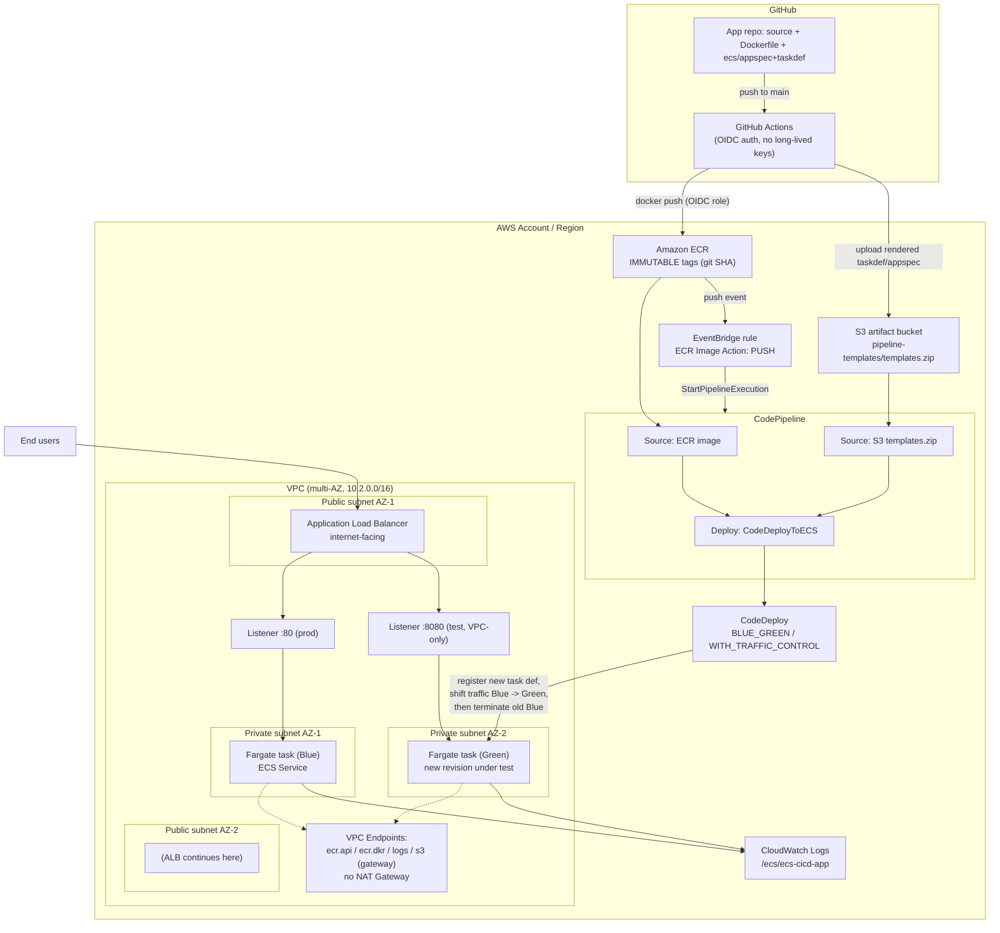

# Architecture Diagram — ECS CI/CD Lab

Diagram-as-code (Mermaid) describing the network, runtime, and CI/CD paths.
Renders natively on GitHub and in any Mermaid-aware viewer.

## Key points the diagram encodes

- **Two repos, two responsibilities**: the *app* repo owns build/push (GitHub
  Actions, OIDC to AWS, no static keys); the *infrastructure* repo owns
  everything else (network, ECS, ALB, pipeline), deployed via CloudFormation
  GitSync.
- **No NAT Gateway**: ECS tasks are fully private and reach ECR/CloudWatch
  Logs only through VPC interface/gateway endpoints — lower cost, smaller
  network attack surface than routing egress through a NAT Gateway.
- **Push-triggered pipeline**: EventBridge — not polling — starts
  CodePipeline the moment a new image lands in ECR.
- **Blue/green, not rolling**: CodeDeploy stands up a full new (Green) task
  set behind the test listener (port 8080, VPC-only), validates it, flips
  the prod listener (port 80) to Green, then tears down the old Blue set —
  so a bad deploy can be caught before it ever reaches port 80.
